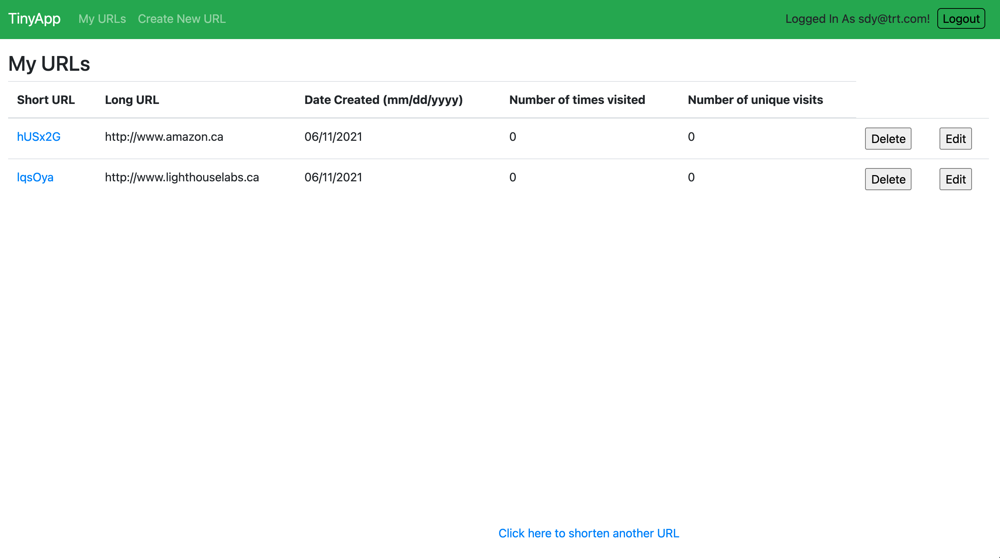

# TinyApp
TinyApp is a full stack web application built with Node and Express that allows users to shorten long URLs (à la bit.ly).

This project is made as an project during week 3 of Lighthouse Labs Bootcamp. The goal of this project is to learn to build an HTTP server that handles requests from the browser(client) and also to learn Express, ejs and other middleware along the way.

## Final Product
###### Login Page

###### Register Page

###### Short URL List of user logged in

###### Create new short URL page

###### Update page

## Dependencies

- Node.js
- Express
- EJS
- bcrypt
- body-parser
- cookie-session

## Getting Started

- Install all dependencies (using the `npm install` command).
- Run the development web server using the `node express_server.js` command.